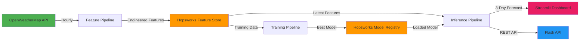

# 🌍 Pearls AQI Predictor — Lahore

An end-to-end machine learning pipeline for predicting the Air Quality Index (AQI) in Lahore, Pakistan for the next 3 days. Built with a 100% serverless stack featuring automated data collection, feature engineering, model training, and real-time predictions through an interactive web dashboard.


---

## 📐 Architecture



### Pipeline Flow

1. **Feature Pipeline** — Fetches air pollution & weather data from OpenWeatherMap APIs every hour
2. **Feature Store** — Stores processed features in Hopsworks (with local Parquet fallback)
3. **Training Pipeline** — Trains 4 models daily (Ridge, Random Forest, XGBoost, LSTM), selects the best
4. **Inference Pipeline** — Generates 3-day AQI forecasts using the best model
5. **Web Dashboard** — Displays predictions, alerts, and SHAP explanations via Streamlit

---

## 🚀 Quick Start

### Prerequisites

- Python 3.10+
- [OpenWeatherMap API key](https://openweathermap.org/api) (free tier)
- [Hopsworks account](https://app.hopsworks.ai/) (free tier, optional)

### 1. Clone & Install

```bash
git clone https://github.com/your-username/aqi-predictor.git
cd aqi-predictor

python -m venv venv
venv\Scripts\activate    # Windows
# source venv/bin/activate  # macOS/Linux

pip install -r requirements.txt
```

### 2. Configure API Keys

```bash
cp .env.example .env
# Edit .env with your API keys
```

### 3. Backfill Historical Data

```bash
python -m src.feature_pipeline.backfill --days 30 --no-hopsworks
```

### 4. Train Models

```bash
python -m src.training_pipeline.train --no-hopsworks
```

### 5. Generate Predictions

```bash
python -m src.inference.predict
```

### 6. Launch Dashboard

```bash
streamlit run app/streamlit_app.py
```

### 7. Launch Flask API (optional)

```bash
python app/flask_api.py
```

---

## 📁 Project Structure

```
AQI/
├── .github/workflows/              # CI/CD automation
│   ├── feature_pipeline.yml        # Hourly feature ingestion
│   ├── training_pipeline.yml       # Daily model retraining
│   └── ci.yml                      # Lint & test on push/PR
├── app/                            # Web application
│   ├── streamlit_app.py            # Streamlit dashboard
│   ├── flask_api.py                # Flask REST API
│   └── alerts.py                   # AQI alert system
├── notebooks/                      # Jupyter notebooks
│   └── 01_eda.ipynb                # Exploratory Data Analysis
├── src/                            # Core source code
│   ├── config.py                   # Central configuration
│   ├── feature_pipeline/           # Data ingestion & engineering
│   │   ├── fetch_data.py           # OpenWeatherMap API client
│   │   ├── feature_engineering.py  # Feature computation
│   │   ├── feature_store.py        # Hopsworks / local storage
│   │   ├── backfill.py             # Historical data backfill
│   │   └── run_pipeline.py         # Pipeline orchestrator
│   ├── training_pipeline/          # Model training
│   │   ├── models/
│   │   │   ├── ridge_model.py      # Ridge Regression
│   │   │   ├── random_forest.py    # Random Forest
│   │   │   ├── xgboost_model.py    # XGBoost
│   │   │   └── lstm_model.py       # LSTM (TensorFlow)
│   │   ├── evaluate.py             # Metrics & comparison
│   │   └── train.py                # Training orchestrator
│   ├── inference/                  # Prediction generation
│   │   └── predict.py              # 3-day forecast engine
│   └── explainability/             # Model interpretability
│       ├── shap_explain.py         # SHAP explanations
│       └── lime_explain.py         # LIME explanations
├── tests/                          # Test suite
│   ├── test_feature_pipeline.py
│   ├── test_training.py
│   └── test_inference.py
├── requirements.txt
├── .env.example
├── .gitignore
└── README.md
```

---

## 🤖 Models

| Model | Type | Description |
|-------|------|-------------|
| **Ridge Regression** | Statistical | Linear baseline with L2 regularization |
| **Random Forest** | Ensemble | Non-linear tree ensemble |
| **XGBoost** | Gradient Boosting | State-of-the-art tabular model |
| **LSTM** | Deep Learning | TensorFlow recurrent net for temporal patterns |

### Features Used

| Category | Features |
|----------|----------|
| **Pollutants** | PM2.5, PM10, NO₂, SO₂, CO, O₃ |
| **Weather** | Temperature, Humidity, Wind Speed, Pressure |
| **Time** | Hour, Day of Week, Month, Weekend, Season |
| **Derived** | AQI Change Rate, PM2.5/PM10 Ratio, Rolling Averages (6h/12h/24h) |
| **Lag** | AQI at t-1, t-3, t-6, t-12, t-24 hours |

### Evaluation Metrics

- **RMSE** (Root Mean Squared Error) — primary selection metric
- **MAE** (Mean Absolute Error)
- **R²** (Coefficient of Determination)

---

## 🌐 API Endpoints

| Endpoint | Method | Description |
|----------|--------|-------------|
| `/health` | GET | Health check |
| `/predict` | GET | 3-day AQI forecast |
| `/features` | GET | Latest feature values |
| `/explain` | GET | SHAP feature importance |
| `/models` | GET | List trained models |
| `/alerts` | GET | Current alert status |

---

## ⚙️ CI/CD

| Workflow | Schedule | Purpose |
|----------|----------|---------|
| `feature_pipeline.yml` | Every hour | Fetch & store new data |
| `training_pipeline.yml` | Daily at 2 AM UTC | Retrain models |
| `ci.yml` | On push/PR | Lint + test |

### GitHub Secrets Required

- `OPENWEATHER_API_KEY`
- `HOPSWORKS_API_KEY`
- `HOPSWORKS_PROJECT_NAME`

---

## 🧪 Testing

```bash
pytest tests/ -v
```

---

## 📊 AQI Categories

| AQI Range | Category | Color |
|-----------|----------|-------|
| 0–50 | Good | 🟢 |
| 51–100 | Moderate | 🟡 |
| 101–150 | Unhealthy for Sensitive Groups | 🟠 |
| 151–200 | Unhealthy | 🔴 |
| 201–300 | Very Unhealthy | 🟣 |
| 301–500 | Hazardous | ⚫ |

---

## 🛠️ Technology Stack

- **ML/DL:** Scikit-learn, XGBoost, TensorFlow/Keras
- **Feature Store:** Hopsworks
- **Data:** OpenWeatherMap API (Air Pollution + Weather)
- **Dashboard:** Streamlit + Plotly
- **API:** Flask + Flask-CORS
- **Explainability:** SHAP, LIME
- **CI/CD:** GitHub Actions
- **Testing:** pytest

---

## 📝 License

MIT License — see [LICENSE](LICENSE) for details.
